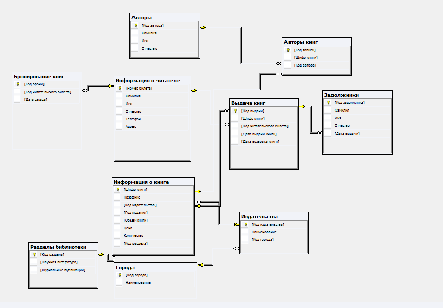

# Описание физической модели 📖📕

# Информация о читателе
| Наименование поля | 	Тип данных |
|--------|--------|
|	Номер билета	|	Счетчик	|📖
|	Фамилия	|	Текстовый	|
|	Имя	|	Текстовый	|
|	Отчество	|	Текстовый	|
|	Телефон	|	Текстовый	|
|	Адрес	|	Текстовый	|

####  Информация о книге

| Наименование поля | 	Тип данных |
|--------|--------|
|	Шифр книги	|	Счетчик	|
|	Название	|	Текстовый	|
|	Код издательства	|	Числовой	|
|	Год издания	|	Текстовый	|
|	Объем книги	|	Числовой	|
|	Цена	|	Числовой	|
|	Количество	|	Числовой	|
|	Код раздела	|	Числовой	|

####  Выдача книг
| Наименование поля | 	Тип данных |
|--------|--------|
|	Код выдачи	|	Счетчик	|
|	Шифр книги	|	Числовой	|
|	Код читательского билета	|	Числовой	|
|	Дата выдачи книги	|	Дата/время	|
|	Дата возврата книги	|	Дата/время	|
]
#### Бронирование книг
| Наименование поля | 	Тип данных |
|--------|--------|
|	Код брони	|	Счетчик	|
|	Шифр книги	|	Числовой	|
|	Код читательского билета	|	Числовой	|
|	Дата заказа	|	Дата/время	|
|	Код брони	|	Счетчик	|

#### Издательства
| Наименование поля | 	Тип данных |
|--------|--------|
|	Код издательства	|	Счетчик
|	Наименование	|	Текстовый
|	Код города	|	Числовой

#### Авторы
| Наименование поля | 	Тип данных |
|--------|--------|
|	Код автора	|	Счетчик	|
|	Фамилия	|	Текстовый	|
|	Имя	|	Текстовый	|
|	Отчество	|	Текстовый	|

#### Авторы книг
| Наименование поля | 	Тип данных |
|--------|--------|
|	Код записи	|	Счетчик	|
|	Шифр книги	|	Числовой	|
|	Код автора	|	Числовой	|

#### Города
| Наименование поля | 	Тип данных |
|--------|--------|
|	Код города	|	Счетчик	|
|	Наименование	|	Текстовый	|

#### Разделы библиотеки
| Наименование поля | 	Тип данных |
|--------|--------|
|	Код раздела	|	Счетчик	|
|	Научная литература	|	Логический	|
|	Журнальные публикации	|	Логический	|

#### Задолжники
| Наименование поля | 	Тип данных |
|--------|--------|
|	Код задолжника	|	Счетчик	|
|	Фамилия	|	Числовой	|
|	Имя	|	Числовой	|
|	Отчество	|	Числовой	|
|	Дата выдачи	|	Числовой	|